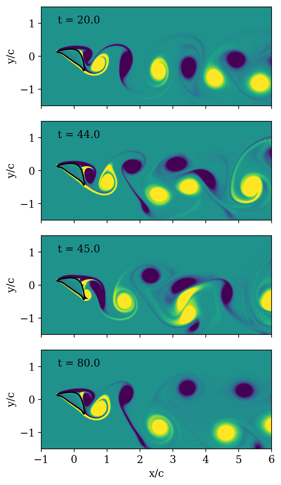

# 2D flow around a snake cross-section (Re=2000, AoA=35deg)

The present directory contains the input files to run, with Batch Shipyard, a PetIBM simulation to compute the two-dimensional flow around a gliding-snake cross-section at Reynolds number $2000$ and with a $35$-degree angle of attack.

With Batch Shipyard and Azure-CLI, we submitted a job to a pool of 2 NC24r instances with FDR InfiniBand network.
The single-task job was submitted to the pool on December 6, 2018.
The container-based PetIBM application computed $200,000$ time steps of flow simulation in just over 7 hours, using 12 MPI processes and 2 GPU devices per node.

## Contents

* `config_shipyard`: YAML configuration files for Batch Shipyard.
  * `config.yaml`: global configuration.
  * `pool.yaml`: pool configuration.
  * `jobs.yaml`: jobs configuration.
* `config.yaml`: YAML configuration file for PetIBM.
* `config`: configuration files for the linear solvers in PetIBM.
* `data/snake2d.body`: initial geometry of the 2D snake cross-section.
* `snake2d2k35.body`: geometry of the 2D snake cross-section with a $35$-degree angle of attack.
* `run-petibm.sh`: Bash script to run inside the Docker container on Azure Batch.
* `scripts`: pre- and post-processing scripts.

(Note: the Batch Shipyard configuration file with the credentials, `credentials.yaml`, is not version-controlled as it contains sensitive information. You will have to generate it before creating the pool with Batch Shipyard.)

## Run

Make sure you have created a Azure Batch account and a Azure Storage account for your personal Azure subscription.
All command-lines written below are run from the `README`'s directory.
The environment variable `CLOUDREPRO` contains the path of the `cloud-repro` git folder on the local machine.

i- (optional) Create the rotated geometry of the snake cross-section:

```shell
python scripts/create_body.py
```

(The Python script will write the file `snake2d2k35.body`.)

ii- (optional) Create the YAML node `mesh` to be added to the `config.yaml` PetIBM configuration file:

```shell
python scripts/create_mesh_yaml.py
```

(The Python script will write the file `mesh.yaml`, which contains the YAML node `mesh` to add/replace in `config.yaml`.)

Output: `mesh.yaml` (content to be placed into the global YAML configuration file `config.yaml`).

1- Generate the YAML configuration file with your credentials:

```shell
python $CLOUDREPRO/misc/generatecredentials.py \
    --resource-group <Name of the resource group> \
    --account-name <Name of the storage account> \
    --share-name <Name of the file share> \
    --output config_shipyard/credentials.yaml
```

2- Create a `snake2d2k35` directory in the fileshare:

```shell
az storage directory create --name snake2d2k35 \
    --account-name <Name of the storage account> \
    --share-name <Name of the file share>
```

3- Create the pool, ingress input data, submit the job, and delete the pool upon completion:

```shell
export SHIPYARD_CONFIGDIR=config_shipyard
shipyard pool add
shipyard data
shipyard jobs add

## wait for task completion

shipyard jobs del
shipyard pool del
```

or, alternatively, you can use the Shell script `shipyard-driver` to automatically delete the pool once the task in the job completed successfully:

```shell
export PATH=$CLOUDREPRO/misc/bin:$PATH
shipyard-driver
```

The Shell script will ask you to provide the path of the configuration directory for Batch Shipyard (which is `config_shipyard` here) and your Microsoft Azure password.
By default, it will save the Batch Shipyard logging files into the sub-folder `log_shipyard`.

4- Download the output from Azure Storage to the local machine:

```shell
mkdir output
az storage file download-batch --destination output
    --source <Name of the file share>/snake2d2k35 \
    --account-name <Name of the storage account>
```

(The size of the `output` folder downloaded from Azure Storage should be about 8 GB.)

5- Delete the `snake2d2k35` directory on Azure Storage:

```shell
export PATH=$CLOUDREPRO/misc/bin:$PATH
az-storage-directory-delete --name snake2d2k35 \
    --account-name <Name of the storage account> \
    --share-name <Name of file share>
```

## Output

The numerical solution is now located in the `output` folder.

The ASCII file `forces-0.txt` contains the forces on the snake's cross-section at each time step.
The ASCII file `iterations-0.txt` contains the number of iterations and the final residuals of the linear solvers at each time step.
The HDF5 file `grid.h5` contains the grid data.
The folder `solution` contains HDF5 files, one for each time-step saved, with the solution of the field variables (pressure, velocity components) as well as the data needed to restart a simulation.

## Post-processing steps

* History of the force coefficients

To plot the lift and drag coefficients:

```shell
python scripts/plot_force_coefficients.py
```

The Python script will save the Matplotlib figure as a PNG file, `forceCoefficients.png`, in the sub-folder `figures`.

* Vorticity

Use the PetIBM executable `petibm-vorticity` to compute the vorticity field at saved time steps.

```shell
cd output
petibm-vorticity
```

The numerical solution of the vorticity in stored in the HDF5 files located in `solution`.

For 2D simulations, PetIBM saves the vorticity field as a 3D array with only one element in the third direction.
Thus, we visualize the vorticity as a 2D array, we need to re-generate the vorticity solution.
This can be done with the Python script `scripts/get_vorticity2d.py`.

```shell
python scripts/get_vorticity2d.py
```

The Python script will save the 2D vorticity in the folder `output/postprocessing/wz`.
(The folder also contains a XDMF file to visualize the 2D vorticity field with VisIt.)

To plot the filled contour of the 2D vorticity field at saved time steps:

```shell
conda activate py27-visit
python scripts/plot_wz_wake2d_visit.py
conda deactivate
```

Figures of the filled contour are saved as PNG files in the folder `figures` (filename prefix `wz_wzke2d_`).
(Note that the Python script requires to set the environment variable `VISIT_DIR` with the path of VisIt on the local machine.)

## Re-create the figure in the manuscript

To re-generate the figure of the filled contour of the 2D vorticity field at 4 time steps:

```shell
python scripts/plot_wz_waked2d_pyplot.py
```

The Python script saves the Matplotlib figure as a PNG file (`wz_multi_contourf.png`) in the `figures` folder.


